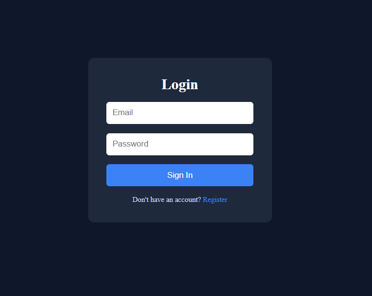
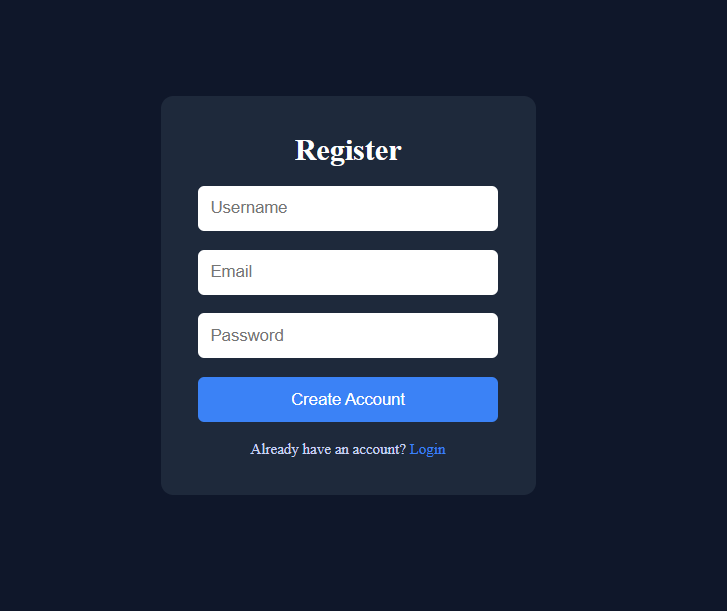
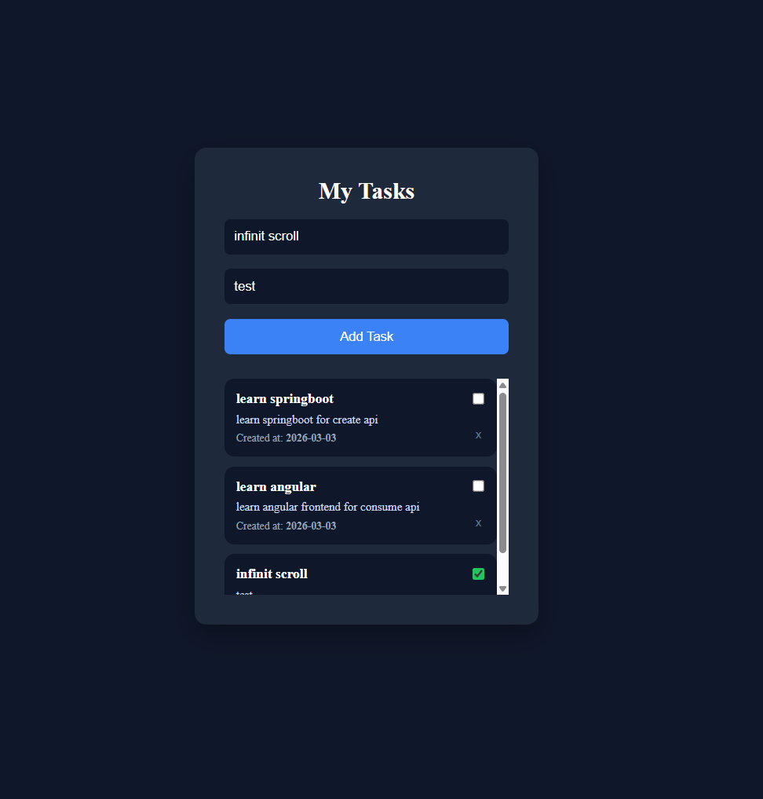

# Task Manager (Fullstack)

Fullstack application for task management with JWT-based authentication.
Each user has their own tasks and can create, list, mark as completed, and delete them.

> Backend is the main focus (Spring Security + JWT + OAuth2 Resource Server).
> Frontend built with Angular only consumes and displays the API data.

---

## Technologies

### Backend

* Java 25 (LTS)
* Spring Boot
* Spring Security
* OAuth2 Resource Server
* JWT (RSA)
* H2 Database

### Frontend

* Angular
* TypeScript
* HTML / SCSS

---

## 📦 Features

* User registration
* Login with JWT token generation
* Authentication via Bearer Token
* Task management:

  * Create task
  * List user tasks
  * Mark as completed
  * Delete task
* User data isolation
* Global exception handling

---

## ⚙️ Requirements

Install:

* Java 25
* Node.js 22
* npm 11
* Angular CLI
* OpenSSL

---

## 🔐 JWT Key Configuration

Inside:

```
src/main/resources/keys
```

### 1. Generate private key

```
openssl genrsa -out jwt-private.key 4096
```

### 2. Generate public key

```
openssl rsa -in jwt-private.key -pubout -out jwt-public.key
```

> These keys are required for JWT authentication to work.

---

## 🗄️ Database

The project uses **H2** (in-memory) by default.

To change it:

* Edit `application.yaml`
* Configure another database (e.g., MySQL)

---

## ▶️ Running the Project

### Backend (Spring Boot)

Run the application:

```
./mvnw spring-boot:run
```

or directly from your IDE.

Server:

```
http://localhost:8080
```

---

### Frontend (Angular)

Inside the frontend folder:

```
npm install
ng serve
```

Access:

```
http://localhost:4200
```

---

## 🌐 CORS

If needed, update in backend:

```
config.setAllowedOrigins(List.of(
  "http://localhost:4200",
  "http://YOUR_IP:4200"
));
```

---

## 📁 Project Structure

### Backend

* auth → authentication (login/register)
* security → JWT and Spring Security configuration
* task → task business logic
* user → user entity
* exception → global error handling

### Frontend

* auth → guard, interceptor and auth service
* home → main screen (tasks)
* login / register → authentication screens

---

## 📸 Screenshots

### Login




### Register



### Home (Tasks)



---

## 📌 Notes

* Project focused on learning secure backend development
* Stateless authentication using JWT
* Layered architecture (controller, service, repository)
* Simple frontend just for API consumption

---

## Future Improvements

* Deploy (Docker / Cloud)
* Persistent database (PostgreSQL/MySQL)
* Refresh Token
* UI improvements

---

## Author

Matheus R.M Silva
